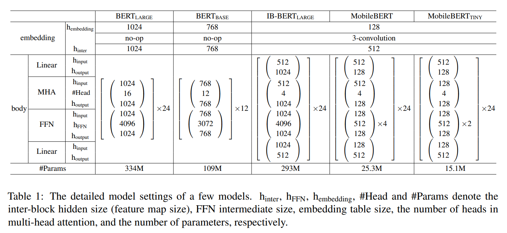

# MobileBERT paddle

使用 `paddlepaddle` 实现 `transformers` 中提供的 `MobileBERT` 模型。


论文： **MobileBERT: a Compact Task-Agnostic BERT for Resource-Limited Devices**

https://arxiv.org/abs/2004.02984


huggingface 模型页面：  

https://huggingface.co/google/mobilebert-uncased


transformers 源代码：

https://github.com/huggingface/transformers/tree/master/src/transformers/models/mobilebert


## 论文和代码解析

本文对bert模型进行了知识迁移，把大模型的知识迁移到小模型中。

深层网络会很难训练，尤其是在小模型中我们把模型的“腰”收的很紧，这样就更不容易训练了。所以这里作者采取的方法是，先训练一个大尺寸的网络作为教师，然后在小模型（学生）网络的设计中，把每一层的 feature map 设计成相同的形状。这样，就可以在训练时，让这两个模型尽量对齐。

### 模型设计

这里结合论文和代码，对模型设计进行介绍。我想用一个先总后分的方法来讲。

先自上而下，讲解模型的构造，再从下到上，看每一个子网络的实现。

```python
class MobileBertModel(MobileBertPreTrainedModel):
    def __init__(self, config, add_pooling_layer=True):
        super().__init__(config)
        self.config = config
        self.embeddings = MobileBertEmbeddings(config)
        self.encoder = MobileBertEncoder(config)
        self.pooler = MobileBertPooler(config) if add_pooling_layer else None
```

`MobileBertModel` 包括 embedding 和 encoder，以及一个 pooler。
（原文中没有 pooler， 所以我们一会儿先看看 pooler是干什么的。）




### 🌊 Pooler

我们先看这个“可有可无”的 pooler:

```python
class MobileBertPooler(nn.Layer):
    def __init__(self, config):
        super().__init__()
        self.do_activate = config.classifier_activation
        if self.do_activate:
            self.dense = nn.Linear(512, 512)

    def forward(self, hidden_states):
        # We "pool" the model by simply taking the hidden state corresponding
        # to the first token.
        first_token_tensor = hidden_states[:, 0]
        if not self.do_activate:
            return first_token_tensor
        else:
            pooled_output = self.dense(first_token_tensor)
            pooled_output = paddle.tanh(pooled_output)
            return pooled_output
```

解释：encoder最后会输出 `(batch_size, 24, 512)` 维的向量。

24是body的数量，512是设置的embedding维度，MobileBERT的body设计刚好是进512出512。

这里pooler的意思是直接拿第一个512作为模型输出，或者是再加一层 Linear，还是输出 512。 

因此，这个 Pooler 确实是 “可有可无”， 哈哈。


### 🍩 Embedding

```python
class MobileBertEmbeddings(nn.Layer):
    def __init__(self, config):
        super().__init__()
        self.trigram_input = True
        self.embedding_size = 128
        self.hidden_size = 512

        self.word_embeddings = nn.Embedding(config.vocab_size, 128, padding_idx=0)
        self.position_embeddings = nn.Embedding(512, 512)
        self.token_type_embeddings = nn.Embedding(2, 512)

        embed_dim_multiplier = 3 if self.trigram_input else 1
        embedded_input_size = self.embedding_size * embed_dim_multiplier
        self.embedding_transformation = nn.Linear(embedded_input_size, 512)

        self.LayerNorm = NoNorm(512)
        self.dropout = nn.Dropout(config.hidden_dropout_prob)
```

（其中部分 config 项被我换成了数字。）
很清楚，一个word embedding，一个 position embedding，一个 token type embedding。

```python
    def forward(self, input_ids, token_type_ids, position_ids, inputs_embeds):
        if self.trigram_input:
            inputs_embeds = paddle.concat([
                nn.functional.pad(inputs_embeds[:, 1:], [0, 0, 0, 1, 0, 0], value=0),
                inputs_embeds,
                nn.functional.pad(inputs_embeds[:, :-1], [0, 0, 1, 0, 0, 0], value=0),
            ], axis=2)

        if self.trigram_input or self.embedding_size != self.hidden_size:
            inputs_embeds = self.embedding_transformation(inputs_embeds)

        position_embeddings = self.position_embeddings(position_ids)
        token_type_embeddings = self.token_type_embeddings(token_type_ids)
        
        embeddings = inputs_embeds + position_embeddings + token_type_embeddings

        embeddings = self.LayerNorm(embeddings)
        embeddings = self.dropout(embeddings)
        return embeddings
```

（为方便阅读，部分删去。）

用3-gram的话，就要把 input 左错开1位，右错开1位，concat起来，就得到了3-gram向量。

再过一个 embedding 变成512。MobileBERT的一个设计就是输入的embedding尺寸是128，经过一个fc变成512。


### 🍭 Encoder

Encoder 是模型的主干部分。

```python
class MobileBertEncoder(nn.Layer):
    def __init__(self, config):
        super().__init__()
        self.layer = nn.LayerList(
            [MobileBertLayer(config) for _ in range(24)])
```

论文中的图果然诚不欺我，真的就是24个body的部分串起来。

```python
    def forward(
            self,
            hidden_states,
            attention_mask=None,
            head_mask=None,
            output_attentions=False,     # 是否要输出 attention
            output_hidden_states=False,  # 是否要输出隐藏状态
            return_dict=True,
    ):
        all_hidden_states = () if output_hidden_states else None
        all_attentions = () if output_attentions else None


        for i, layer_module in enumerate(self.layer):  # 每次过一个layer
            if output_hidden_states:
                all_hidden_states = all_hidden_states + (hidden_states,)

            layer_outputs = layer_module(
                hidden_states,
                attention_mask,
                head_mask[i],
                output_attentions,
            )

            hidden_states = layer_outputs[0]  # <-  隐藏状态用于下一层输入

            if output_attentions:
                all_attentions = all_attentions + (layer_outputs[1],)  # <- 本层 attention 

        # Add last layer
        if output_hidden_states:
            all_hidden_states = all_hidden_states + (hidden_states,)

        if not return_dict:
            return tuple(v for v in [hidden_states, all_hidden_states, all_attentions] if
                         v is not None)
        return BaseModelOutput(last_hidden_state=hidden_states,
                               hidden_states=all_hidden_states,
                               attentions=all_attentions)
```

很直观，就是把24个 Layer 层过了一遍，每一层会输出自己的 hidden state，最后一层的 hidden state 作为encoder 最终输出。


### 🎄 MobileBERTLayer

```python
class MobileBertLayer(nn.Layer):
    def __init__(self, config):
        super().__init__()
        self.use_bottleneck = True
        self.num_feedforward_networks = 4

        self.attention = MobileBertAttention(config)
        self.intermediate = MobileBertIntermediate(config)
        self.output = MobileBertOutput(config)
        if self.use_bottleneck: self.bottleneck = Bottleneck(config)
        if config.num_feedforward_networks > 1:
            self.ffn = nn.LayerList([FFNLayer(config) for _ in range(config.num_feedforward_networks - 1)])
```

这里要参考上面论文里的图。


### 训练策略


